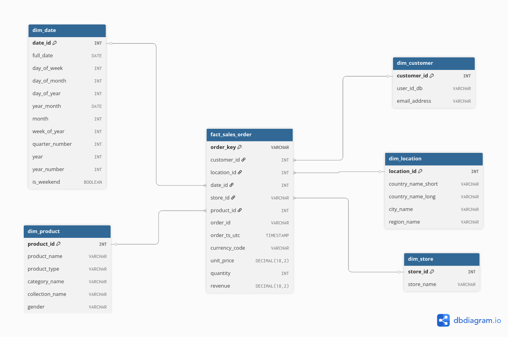

# Glamira dbt Project

Dự án này xây dựng **data warehouse** cho Glamira theo mô hình **Star Schema** bằng **dbt + BigQuery**. Mục tiêu: chuẩn hoá dữ liệu từ staging → marts, tạo các **dimension tables** và **fact table** để phục vụ BI / Analytics.

---

## 🚀 Cách chạy dự án

```bash
dbt run
dbt test
```

---

## 📁 Cấu trúc thư mục

```text
glamira_dbt/
├── analyses/
├── macros/
├── models/
│   ├── staging/
│   │   └── staging_glamira/
│   │       ├── stg_glamira_customer.sql
│   │       ├── stg_glamira_location.sql
│   │       ├── stg_glamira_product.sql
│   │       ├── stg_glamira_sales_order.sql
│   │       ├── stg_glamira_store.sql
│   │       └── stg_glamira.yml
│   │
│   └── marts/
│       └── mart_glamira/
│           ├── dim_date.sql
│           ├── dim_customer.sql
│           ├── dim_location.sql
│           ├── dim_product.sql
│           ├── dim_store.sql
│           ├── fact_sales_order.sql
│           └── mart_glamira.yml
│
├── seeds/
│   └── dim_fx_rate.csv
│
├── snapshots/
├── tests/
├── dbt_project.yml
└── README.md
```

### 🧱 Ý nghĩa từng layer

* **staging/**:

  * Làm sạch dữ liệu từ source (rename column, cast type, clean data, chuẩn hoá format)
  * Mỗi bảng source → 1 staging model

* **marts/**:

  * Chứa **business models**
  * Gồm:

    * Dimension tables: `dim_*`
    * Fact tables: `fact_*`

* **seeds/**:

  * Chứa dữ liệu static (ví dụ: `dim_fx_rate`)

---

## 🗺️ Data Model (Star Schema)

### Tổng quan mô hình



### Các bảng chính

#### 🟦 Fact table

* **fact_sales_order**: bảng  chứa dữ liệu giao dịch bán hàng

#### 🟩 Dimension tables

* **dim_date**: dimension thời gian
* **dim_customer**: dimension lưu thông tin khách hàng
* **dim_product**: dimension lưu thông tin sản phẩm
* **dim_location**: dimension lưu thông tin thành phố/quốc gia/khu 
* **dim_store**: dimension lưu thông tin các cửa hàng

---

## 📚 Tài liệu tham khảo

* [https://docs.getdbt.com](https://docs.getdbt.com)
* [https://www.kimballgroup.com](https://www.kimballgroup.com)